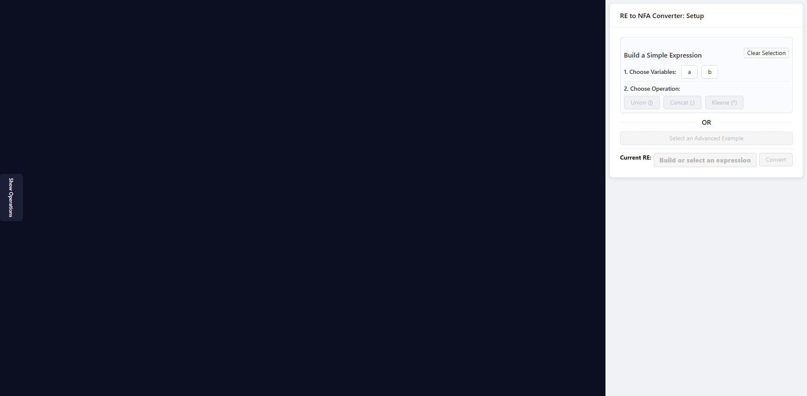
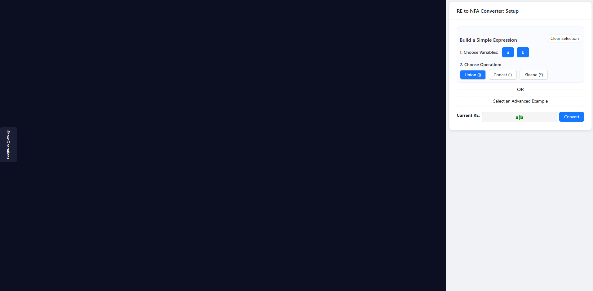
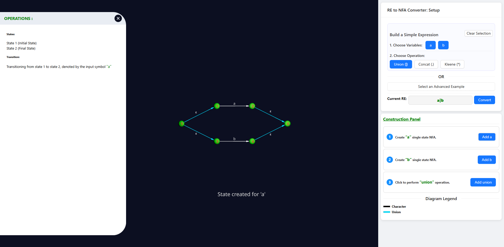
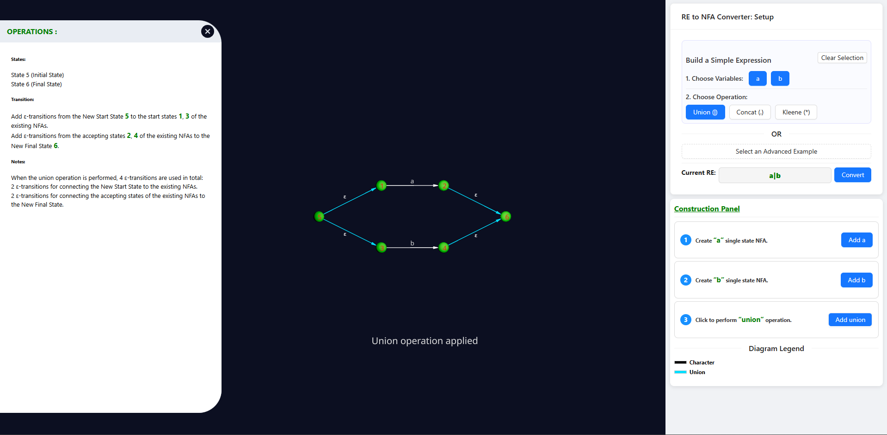
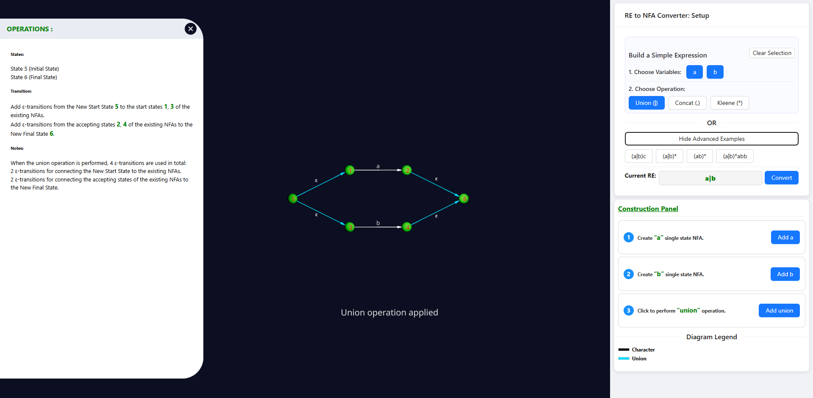

 

#### Step 1: Choose Variables and Operations  

1. Open the **Setup Panel** on the right side of the interface.  
   - This panel is used to build a regular expression by selecting variables and operations.  

2. **Select Variables**  
   - Under **“1. Choose Variables”**, click one or more variable buttons (e.g., `a`, `b`).  
   - Selected variables will be highlighted.  
   - Example: Click `a` and `b` to choose both.  

     

3. **Choose an Operation**  
   - After selecting variables, the operation buttons under **“2. Choose Operation”** become active.  
   - Choose one operation to combine the variables:  
     - **Union (|):** OR of variables  
     - **Concatenation (.):** joining variables  
     - **Kleene Star (*):** zero or more repetitions  
   - Example: Click **Union (|)** to create `a|b`.  

     

4. **View the Current Expression**  
   - The **Current RE** field shows the constructed expression (e.g., `a|b`).  
   - Click **Convert** to generate an NFA.  

> 💡 **Tip:** Start with simple expressions (`a`, `b`, `a|b`) before trying complex ones.  

---

#### Step 2: Build the NFA in the Construction Panel  

1. Open the **Construction Panel** below the setup area.  
   - This panel is used to create NFAs step by step.  

2. **Add States and Operations**  
   - Click **Add a** or **Add b** to create single-state NFAs for variables.  
   - Use operations (e.g., **Add union**) to combine them.  
   - The NFA diagram updates to show states, transitions, and ε-transitions.  
   - The left panel displays details of states and transitions.  

  

---

#### Step 3: View Operation Details  

1. **Highlight States and Operations**  
   - After performing an operation, select the states involved.  
   - The diagram highlights the applied operation (e.g., “Union operation applied”).  

2. **Check Operation Details**  
   - The **Operations panel** on the left shows:  
     - Initial and final states  
     - Transitions (with ε-transitions)  
     - Notes explaining construction steps  

3. **Understand the Process**  
   - Follow these details to learn Thompson’s construction step by step.  

  

---

#### Step 4: Use Advanced Examples  

1. **Open Advanced Examples**  
   - In the Setup panel, click **Show Advanced Examples**.  
   - Presets such as `(a|b)c`, `(a|b)*`, `(ab)*`, `(a|b)*abb` appear.  

2. **Select an Example**  
   - Click a preset. The **Current RE** field updates to the chosen expression.  

3. **Convert the Example**  
   - Click **Convert** to generate its NFA.  
   - The diagram and Operations panel display construction details.  

4. **Explore or Reset**  
   - Inspect states, transitions, and ε-links.  
   - Use **Clear Selection** to reset, or choose another example.  
   - Hide examples by clicking **Hide Advanced Examples**.  

> 💡 **Tip:** Advanced Examples help visualize complete constructions. Compare them with your manual build from earlier steps.  

  
