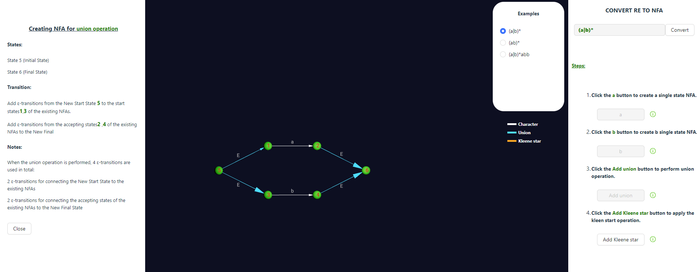

<u><h3>Procedure</u></h3>

1. To convert a regular expression(RE) to a non-deterministic finite automaton (NFA), select a regular expression from the examples given and follow the instructions provided .

2. Read the instruction and click on the button below to generate NFA .

3. Click on the 'info' button to view detailed steps for creating an NFA.

4. Click on button 'b' to generate the NFA for 'b'
 

5. click on Union button to perform the union operation .

6. Click the Add Kleene star button to perform the Kleene Closure operation.

Attempt the remaining examples and follow the instructions in a similar manner.

