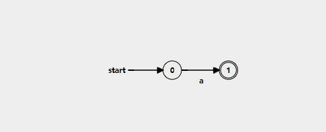
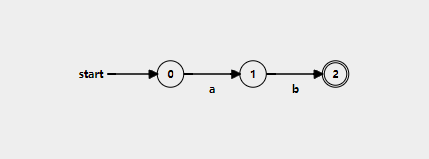
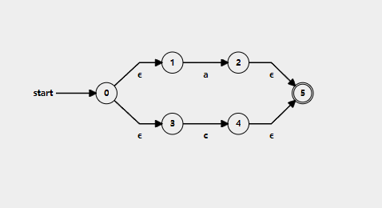
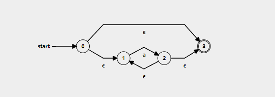

<h3>Theory</h3>
<h4>Finite Automaton (FA)</h4>

A <strong>Finite Automaton</strong> (FA) is a mathematical model of computation that serves as an abstract machine for recognizing patterns. An FA has a finite number of states and transitions between these states based on input symbols. Its primary purpose is to determine whether an input string conforms to a specific, predefined pattern, thereby accepting or rejecting it.

Formally, a finite automaton is a 5-tuple (Q, Σ, δ, q₀, F), where:

<ul>
<li><b>Q</b> is a finite set of states.</li>
<li><b>Σ</b> (Sigma) is a finite set of input symbols, called the alphabet.</li>
<li><b>δ</b> (delta) is the transition function, which maps a state and an input symbol to a next state (in a DFA) or a set of next states (in an NFA).</li>
<li><b>q₀</b> is the initial or start state.</li>
<li><b>F</b> is a set of final or accepting states.</li>
</ul>

Finite automata are the theoretical foundation for <strong>regular languages</strong>. They are crucial in computer science for tasks like lexical analysis in compilers, text searching, and data validation.

<h4>Regular Expressions (RE)</h4>

A <strong>regular expression</strong> is a sequence of characters that specifies a search pattern. It provides a formal, concise syntax for defining a <strong>regular language</strong>—a set of strings that can be recognized by a finite automaton.

A language is regular if and only if it can be described by a regular expression. The formal recursive definition of a regular expression is as follows:

<strong>Base Cases:</strong>

<ul>
<li><strong>ε (Empty String):</strong> The regular expression <strong>ε</strong> represents the language containing only the empty string: <code>L(ε) = {""}</code>.</li>
<li><strong>a (A symbol from the alphabet):</strong> For any symbol <code>a</code> in the alphabet Σ, the regular expression <strong>a</strong> represents the language containing only that symbol: <code>L(a) = {"a"}</code>.</li>
</ul>

<strong>Inductive Steps:</strong> If R₁ and R₂ are regular expressions, then:

<ul>
<li><strong>Union (R₁ | R₂):</strong> The union operation creates a new regular expression that matches strings from either R₁ or R₂. <code>L(R₁ | R₂) = L(R₁) ∪ L(R₂)</code>. It is also known as alternation or choice.</li>
<li><strong>Concatenation (R₁R₂):</strong> The concatenation operation creates a new regular expression that matches strings formed by a string from R₁ followed immediately by a string from R₂. <code>L(R₁R₂) = {xy | x ∈ L(R₁) and y ∈ L(R₂)}</code>.</li>
<li><strong>Kleene Star (R₁*):</strong> The Kleene star (or closure) creates a new regular expression that matches zero or more concatenations of strings from R₁.</li>
</ul>

<strong>Grouping with Parentheses `()`:</strong> Parentheses are used to group sub-expressions, defining the order of operations. For example, in <code>(a|b)c</code>, the union is performed before the concatenation.

<h4>Non-Deterministic Finite Automata (NFA)</strong></h4>

A <strong>Non-Deterministic Finite Automaton (NFA)</strong> is a type of finite automaton where for each pair of state and input symbol, there can be several possible next states. This non-determinism provides greater flexibility in designing automata compared to their deterministic counterparts (DFAs).

<h5>Key Characteristics of an NFA</h5>
<ul>
<li>
<strong>Multiple Transitions:</strong> From a single state, an NFA can have multiple outgoing transitions for the same input symbol. The automaton explores all these paths in parallel.
</li>
<li>
<strong>ε (Epsilon) Transitions:</strong> An NFA can have transitions that occur without consuming any input symbol. These are called <strong>ε-transitions</strong> and allow the automaton to change its state spontaneously.
</li>
<li>
<strong>Acceptance Condition:</strong> An NFA accepts an input string if at least <strong>one</strong> of the possible paths of execution ends in an accepting (final) state after the entire string has been processed.
</li>
<li>
<strong>Equivalence to DFA:</strong> For every NFA, there exists an equivalent Deterministic Finite Automaton (DFA) that recognizes the same regular language. However, the conversion from an NFA to a DFA can lead to an exponential increase in the number of states.
</li>
</ul>
<h4>Thompson's Algorithm: Converting a Regular Expression to an NFA</h4>

<strong>Thompson's construction algorithm</strong> is a method for converting a regular expression into an equivalent NFA. The algorithm works recursively, building NFAs for the smallest parts of the regular expression and then combining them using a set of rules that correspond to the operations of union, concatenation, and Kleene star.

A key property of Thompson's construction is that every sub-automaton it builds has **exactly one start state and one final (accept) state**, which allows them to be composed easily.

<h5><strong>Construction Rules</strong></h5>

The algorithm is defined by a set of rules for each type of regular expression.

<h6><strong>1. Base Case: An empty string ε</strong></h6>

To recognize an empty string, create a start state and a final state, connected by an ε-transition.

<h6><strong>2. Base Case: A single symbol `a`</strong></h6>

To recognize a single symbol `a` from the alphabet, create a start state and a final state, connected by a transition labeled with `a`.

<strong>Regular Expression: "a"</strong>

<h6><strong>3. Operation: Concatenation (R₁R₂)</strong></h6>

To construct the NFA for the concatenation of two regular expressions, R₁ and R₂, represented by NFA(R₁) and NFA(R₂):

<ol>
<li>The start state of the combined NFA is the start state of NFA(R₁).</li>
<li>The final state of the combined NFA is the final state of NFA(R₂).</li>
<li>Connect the final state of NFA(R₁) to the start state of NFA(R₂) with an <strong>ε-transition</strong>. The original final state of NFA(R₁) is no longer final.</li>
</ol>

<strong>Example: "ab"</strong> (Concatenation of "a" and "b")

<h6><strong>4. Operation: Union (R₁|R₂)</strong></h6>

To construct the NFA for the union of two regular expressions, R₁ and R₂:

<ol>
<li>Create a new start state and a new final state.</li>
<li>Add an ε-transition from the new start state to the start state of NFA(R₁).</li>
<li>Add an ε-transition from the new start state to the start state of NFA(R₂).</li>
<li>Add an ε-transition from the final state of NFA(R₁) to the new final state.</li>
<li>Add an ε-transition from the final state of NFA(R₂) to the new final state.</li>
</ol>

The original start and final states of NFA(R₁) and NFA(R₂) lose their special status.

<strong>Example: "a|c"</strong> (Union of "a" and "c")

<h6><strong>5. Operation: Kleene Star (R*)</strong></h6>

To construct the NFA for the Kleene star of a regular expression R, represented by NFA(R):

<ol>
<li>Create a new start state and a new final state.</li>
<li>Add an ε-transition from the new start state to the start state of NFA(R).</li>
<li>Add an ε-transition from the final state of NFA(R) back to the start state of NFA(R). This creates a loop for one or more repetitions.</li>
<li>Add an ε-transition from the final state of NFA(R) to the new final state.</li>
<li>Add an ε-transition from the new start state directly to the new final state. This allows for zero repetitions (matching the empty string).</li>
</ol>

<strong>Example: "a*"</strong>

By applying these rules recursively, any regular expression can be systematically converted into an NFA that recognizes the same language.
