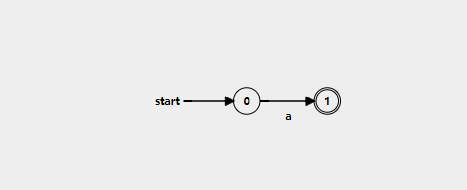
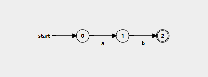

<h1>Theory</h1>

<strong>Finite Automaton (FA)</strong>

A Finite Automaton (FA) is a mathematical model of computation used to recognize and process patterns in a given set of strings. It operates as an abstract machine with a finite number of states and follows predefined rules to determine whether an input string belongs to a particular language.

Finite automata are the building blocks of regular languages and play a crucial role in computational theory, lexical analysis, and compiler design. They provide a systematic way to define and analyze patterns in text, making them essential for text searching, data validation, and language processing.

<strong>Regular Expressions (RE)</strong>

A regular expression is a powerful way to define and describe patterns within a language. It provides a structured method for specifying sets of strings that can be recognized by finite automata.

Regular expressions serve as a formal notation used to define regular languages, which are languages that can be processed by deterministic or non-deterministic finite automata (DFA/NFA). They help in pattern matching, text processing, and defining syntactic structures in programming and computational theory.

At its core, a regular expression is a sequence of symbols and operators that defines a pattern for valid strings in a given language. These expressions are fundamental in computer science, particularly in lexical analysis, text searching, and compiler design.

By using regular expressions, we can describe complex patterns in a simple and readable manner, making them one of the most effective tools for representing and manipulating languages.

<strong>Non-Deterministic Finite Automata (NFA)</strong>

A Non-Deterministic Finite Automaton (NFA) is a type of finite automaton used in automata theory to recognize regular languages. Unlike a Deterministic Finite Automaton (DFA), where each state has exactly one transition for each input symbol, an NFA allows multiple possible transitions for the same input or even transitions without consuming any input (ε-transitions).

<strong>Key Characteristics of NFA</strong>

<strong>Multiple Transitions for the Same Input:</strong>

In an NFA, a state can have multiple outgoing transitions for a single input symbol. This means that for a given input, the automaton can move to several different states instead of just one.

<strong>ε (Epsilon) Transitions:</strong>

An NFA allows transitions that do not consume any input symbols. These are called <strong>ε-transitions</strong> and enable the automaton to change states without reading an input character.

<strong>Flexibility in Path Selection:</strong>

Since an NFA can move to multiple states for the same input, it does not require a fixed transition path like a DFA. Instead, it explores all possible paths simultaneously and accepts if at least one path leads to a final (accepting) state.

<strong>Equivalence to DFA:</strong>

While NFAs provide more flexibility in designing automata, every NFA can be converted into an equivalent DFA that recognizes the same language. However, this conversion may result in a DFA with exponentially more states than the original NFA.

<strong>Operations in Converting a Regular Expression to an NFA</strong>

When converting a Regular Expression (RE) into a Nondeterministic Finite Automaton (NFA), several fundamental operations help in constructing the automaton. Each operation represents a key component of how regular expressions work and how they translate into state transitions in an NFA.

<strong>1. Concatenation</strong>

<strong>Definition:</strong>

Concatenation is the operation of <strong>joining two expressions sequentially</strong>, meaning the second expression follows immediately after the first in any valid string.

<strong>Understanding Concatenation:</strong>

<ul>
    <li>If <strong>R₁</strong> and <strong>R₂</strong> are two regular expressions, then their concatenation (<strong>R₁R₂</strong>) means that a string belonging to <strong>R₁</strong> must be followed directly by a string belonging to <strong>R₂</strong>.</li>
    <li>For example, if <strong>R₁ = "ab"</strong> and <strong>R₂ = "cd"</strong>, then the concatenated expression <strong>"abcd"</strong> is valid, but <strong>"acbd"</strong> is not.</li>
</ul>

<strong>Example Patterns:</strong>

<ul>
    <li><code>"hello" + "world"</code> → Matches <code>"helloworld"</code></li>
    <li><code>"abc" + "123"</code> → Matches <code>"abc123"</code>, but not <code>"ab123c"</code></li>
</ul>

<strong>2. Union (Alternation / Choice)</strong>

<strong>Definition:</strong>

Union provides <strong>a choice between two expressions</strong>, allowing a match with <strong>either</strong> of them. This is represented by the <code>|</code> (pipe symbol) in regular expressions.

<strong>Understanding Union:</strong>

<ul>
    <li>If <strong>R₁ | R₂</strong> represents a regular expression, a valid string can belong to <strong>either R₁ or R₂</strong>.</li>
    <li>It does not mean that both must appear in sequence; rather, the automaton selects one of them at any point.</li>
</ul>

<strong>Example Patterns:</strong>

<ul>
    <li><code>"cat|dog"</code> → Matches <code>"cat"</code> or <code>"dog"</code>, but not <code>"catdog"</code>.</li>
    <li><code>"apple|orange|banana"</code> → Matches <code>"apple"</code>, <code>"orange"</code>, or <code>"banana"</code>.</li>
</ul>

<strong>3. Kleene Star (*)</strong>

<strong>Definition:</strong>

The Kleene star is an operator that allows <strong>zero or more repetitions</strong> of the preceding expression.

<strong>Understanding Kleene Star:</strong>

<ul>
    <li>If <strong>R*</strong> represents a regular expression, it means that the pattern can appear <strong>any number of times</strong>, including not appearing at all (<strong>zero times</strong>).</li>
    <li>It is useful for defining repeating sequences without a fixed limit.</li>
</ul>

<strong>Example Patterns:</strong>

<ul>
    <li><code>"a*"</code> → Matches <code>""</code> (empty string), <code>"a"</code>, <code>"aa"</code>, <code>"aaa"</code>, etc.</li>
    <li><code>"(ab)*"</code> → Matches <code>""</code>, <code>"ab"</code>, <code>"abab"</code>, <code>"ababab"</code>, etc.</li>
</ul>

<strong>4. Grouping (Parentheses for Precedence Control)</strong>

<strong>Definition:</strong>

Grouping is used to <strong>combine parts of a regular expression together</strong> so that operators apply to the whole group rather than just a single character. It ensures the correct <strong>precedence and scope</strong> of operations.

<strong>Understanding Grouping:</strong>

<ul>
    <li>Parentheses <code>()</code> are used to group expressions so that operations like concatenation, union, or repetition apply to the whole group instead of just a single character.</li>
    <li>It is particularly useful when applying the <strong>Kleene star or union</strong> to more than one symbol.</li>
</ul>

<strong>Example Patterns:</strong>

<ul>
    <li><code>"(ab|cd)*"</code> → Matches <code>""</code>, <code>"ab"</code>, <code>"cd"</code>, <code>"abab"</code>, <code>"cdcd"</code>, <code>"abcd"</code>, <code>"cdab"</code>, etc.</li>
    <li><code>"(apple|banana)s?"</code> → Matches <code>"apple"</code>, <code>"apples"</code>, <code>"banana"</code>, <code>"bananas"</code>.</li>
</ul>

These operations are the building blocks of regular expressions and <strong>define how patterns are structured</strong> in an automaton.

<ul>
    <li><strong>Concatenation</strong> ensures <em>order</em> in pattern matching.</li>
    <li><strong>Union</strong> introduces <em>choices</em> in possible matches.</li>
    <li><strong>Kleene star</strong> allows <em>repetition</em>, making patterns more flexible.</li>
    <li><strong>Grouping</strong> ensures that operations apply to the correct part of the pattern, preserving <em>precedence</em>.</li>
</ul>

<strong>Thompson's Algorithm</strong>

Thompson's algorithm is a method for converting a regular expression into an equivalent nondeterministic finite automaton (NFA). The algorithm uses a set of rules to construct the NFA based on the structure of the regular expression, including handling concatenation, union, and the Kleene star. The resulting NFA can then be used to efficiently match the pattern defined by the original regular expression.

<b>Before Diving into the Construction Process, Let's Understand Some Essential Terms:</b>

<strong>1. States</strong>

A <strong>state</strong> represents a particular point in the execution of an automaton.

<ul>
    <li>In NFAs, there can be <strong>multiple states</strong> where a transition can occur for a given input.</li>
    <li>Every automaton has an <strong>initial state</strong> (q₀) and one or more <strong>final states</strong> (F).</li>
</ul>

<strong>2. Transitions</strong>

A <strong>transition</strong> defines how the automaton moves from one state to another based on an input symbol.

<ul>
    <li>NFAs allow <strong>multiple transitions</strong> from a state for a single input.</li>
    <li>They also include <strong>ε (epsilon) transitions</strong>, which move to another state without consuming input.</li>
</ul>

<strong>3. Start and Final State</strong>

<ul>
    <li><strong>Start State:</strong> The initial state from which the automaton begins processing the input string.</li>
    <li><strong>Final State(s):</strong> The state(s) where the automaton halts and accepts a string if it reaches this state after processing the input.</li>
</ul>

<strong>4. ε (Epsilon) Transitions</strong>

An <strong>ε-transition</strong> is a transition that allows the automaton to move to another state <strong>without consuming any input character</strong>.

<strong>Rules to Convert RE to NFA</strong>

<strong>1. Symbol (a) (Basic RE)</strong>

 Create two states: a start state and an accept state (final).

 Add a transition from the start state to the accept state labelled 'a'.

 Mark the final/accept state.

<strong>Example:</strong>

<strong>Regular Expression: "a"</strong>

<strong>2. Concatenation (ab)</strong>

<!-- 
Converting Regular Expression to NFA using Concatenation
 -->

<strong>Create an NFA for the character 'a':</strong>

 Create a start state and an accept state.

 Add a transition labeled 'a' from the start state to the accept state.

<strong>Create an NFA for the character 'b':</strong>

 Create a start state and an accept state.

 Add a transition labeled 'b' from the start state to the accept state.

<strong>Connect the NFAs for 'a' and 'b' to represent the concatenation:</strong>

- Merge the accept state of the NFA for 'a' with the start state of the NFA for 'b', and remove the accept state of the NFA for 'a'.

<strong>Example:</strong>

<strong>Regular Expression: "ab"</strong>

<strong>3. Union (a|b)</strong>

<strong>Creating NFA for Union Operation</strong>

<strong>States:</strong>

 New Start State

 New Final State

<strong>Transitions:</strong>

 Add ε-transitions from the New Start State to the start states of the existing NFAs.

 Add ε-transitions from the accepting states of the existing NFAs to the New Final State.

<strong>Note:</strong>

When the union operation is performed, 4 ε-transitions are used in total:

 2 ε-transitions for connecting the New Start State to the existing NFAs

 2 ε-transitions for connecting the accepting states of the existing NFAs to the New Final State

<strong>Example:</strong>

<strong>Regular Expression: "a|c"</strong>

<strong>4. Kleene Closure (a)*</strong>

<strong>Converting Regular Expression to NFA using Kleene Closure</strong>

<strong>States:</strong>

 New Start State (S₀)

 New Accept State (F₀)

<strong>Transitions:</strong>

 Add ε-transition from New Start State (S₀) to the original start state of the expression.

 Add ε-transition from the accept state of the expression back to the original start state.

 Add ε-transition from original accept state to New Accept State (F₀).

 Add ε-transition from New Start State (S₀) directly to New Accept State (F₀) for zero occurrences.

<strong>Note:</strong>

When applying the Kleene closure function, 4 ε-transitions are used in total:

 2 ε-transitions for connecting the New Start State to the original start state and back to the original start state

 1 ε-transition for connecting the original accept state to the New Accept State

 1 ε-transition from the New Start State directly to the New Accept State for zero occurrences

<strong>Example:</strong>

<strong>Regular Expression: "a*"</strong>

